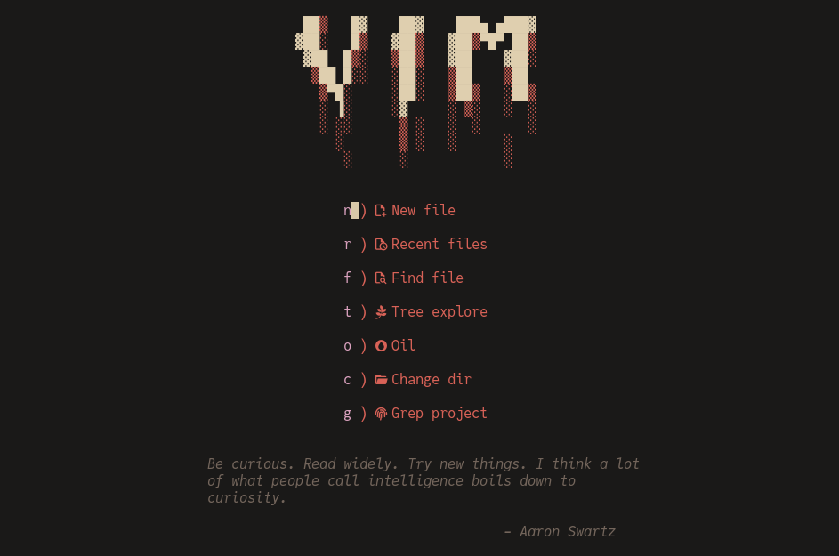

  <h1>VimKnight</h1>
  

    </a>
  

    
    

  

    
  

  

    A simple
    <a href="https://github.com/neovim/neovim/">Neovim</a>
    config
  

## Showcase

## Info

A personal neovim config, written from scratch. It is kinda like a neovim distribution, but much simpler. Maybe more like [kickstart.nvim](https://github.com/nvim-lua/kickstart.nvim).
- Neovim distributions are too overengineered. They split things amongst too many files with (imho) unnecessary cruft in the code. This is simple and easy to hack. It is also fully featured. You can jump in straight into using it. Maybe familiarize yourself with the keybindings first and install a language server or two.
- Tries to not override default keybindings much or do anything too crazy. Notable exceptions are `r` -> [subversive](https://github.com/svermeulen/vim-subversive)(use `s` instead) this should be built into vim tbh; `f` -> [Pounce](https://github.com/rlane/pounce.nvim); `t` -> [Trailblazer](https://github.com/LeonHeidelbach/trailblazer.nvim); `q` -> quit (macro is now <C-q>) because I jump in and out of files too much
  If that is too much, comment them out in `hotkeys.lua`
- The other plugins are almost all under <space>
- Neatly ordered. 1 file per task: 1 for neovim settings, 1 for hotkeys, etc. and a directory for your plugin files
- To disable a plugin, comment it out in `plugin_list.lua` (a few depend on each other though)
- Don't bother keeping up with changes. I won't be making many since this is kinda perfect for me. Also there are no built-in ways to do so anyway. Just clone and go.
- Bug reports are welcome of course, however I am not a real programmer, just a hobbyist. Don't ask for anything crazy.

## Requirements

To install you need:
- `tar`, `unzip`, `curl` and `git` in your path for [Mason](https://github.com/williamboman/mason.nvim) and [Treesitter](https://github.com/nvim-treesitter/nvim-treesitter)
- `make` for [telescope-fzf-native.nvim](https://github.com/nvim-telescope/telescope-fzf-native.nvim)
- A C compiler and libstdc++ installed, for [Treesitter](https://github.com/nvim-treesitter/nvim-treesitter)
- [Nerd font](https://www.nerdfonts.com/font-downloads) - not really that optional; icons are everywhere

**Optional but Recommended**:
- [fd](https://github.com/sharkdp/fd) for telescope file indexing
- [ripgrep](https://github.com/BurntSushi/ripgrep) for searching in your project
- [zoxide](https://github.com/ajeetdsouza/zoxide) for fast directory switching
- luarocks, if you plan to use [neorg](https://github.com/nvim-neorg/neorg) (plugin activates and installs on .norg file opening)
- A terminal with fixed escape sequences (I use foot(wayland) or patched st(x11)) to use <Tab> hotkey independently of <C-i>. Guis also work
